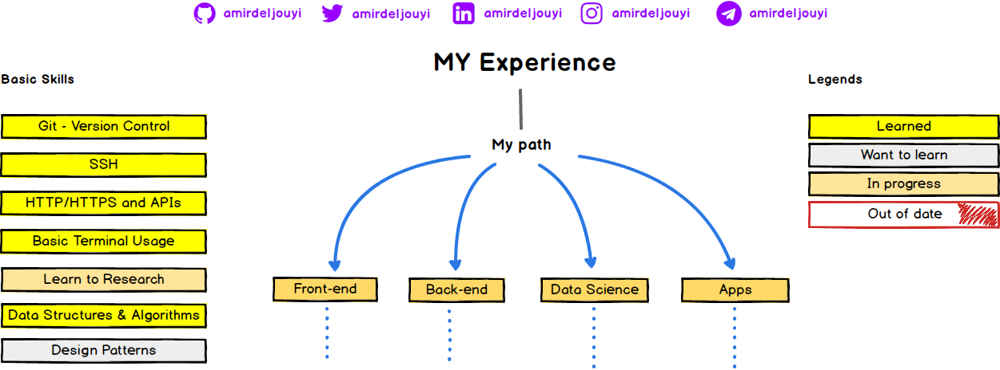
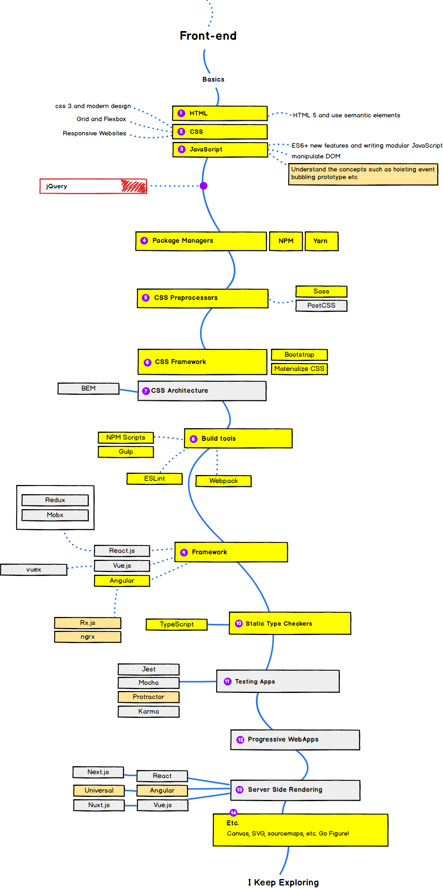
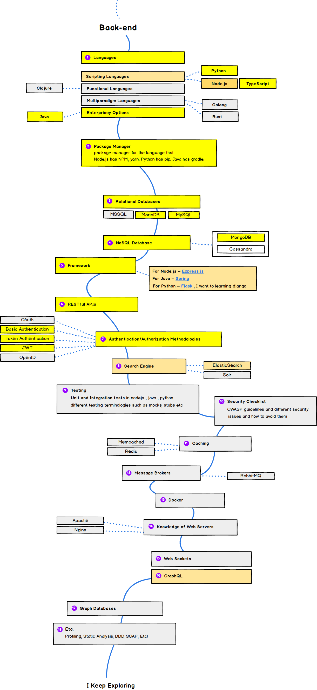
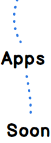
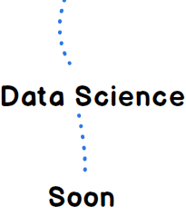

## My Roadmap in 2018

 this technologies which I learned or want learning to become a frontend, backend, data scientist. I  made this charts with inspired from [this](https://github.com/kamranahmedse/developer-roadmap) for a perspective to me.

## 🚀 Introduction

## 🎨 Frontend Roadmap

## 👽 Back-end Roadmap

## 👷 Application Developer Roadmap

## 👷 Data scientist Roadmap

## ☑ TODO

- [X] Add Frontend Roadmap
- [X] Add Backend Roadmap
- [ ] Add Application Developer Roadmap
- [ ] Add Data Scientist Roadmap
- [ ] Add DevOps Roadmap

## 👬 Contribution

The roadmaps are built using [Balsamiq](https://balsamiq.com/products/mockups/). Project file can be found at `/project` directory.	

Help me in this road with your idea and your discussion

- Open pull request with improvements
- Discuss ideas in issues 
- Reach out with any feedback [My Twitter](https://twitter.com/amirdeljouyi)

## License

